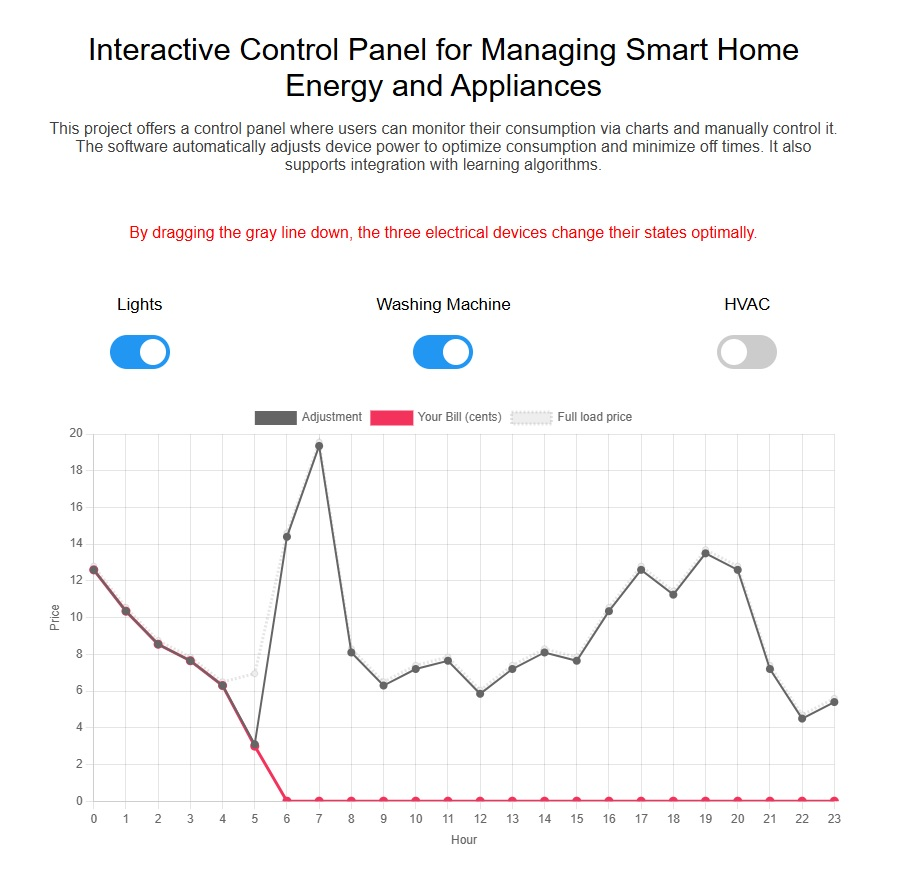

# Interactive Control Panel for Managing Smart Home Energy and Appliances
This project offers a control panel where users can monitor their consumption via charts and manually control it. The software automatically adjusts device power to optimize consumption and minimize off times. It also supports integration with learning algorithms.
## Live Demo
[Click here to see live demo](https://mortezakhakidev.github.io/demo/hems.html)

## Screenshot

